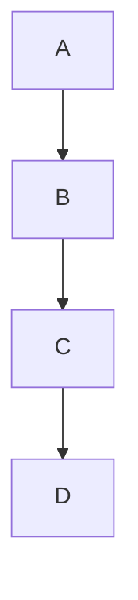

<!-- # 📘 Comprehensive Markdown Guide -->

Markdown is a lightweight markup language that allows you to format text easily. It is widely used for documentation, blogging, and note-taking. This guide will show you **how to write Markdown** and what the **output will look like**.

## 🔍 What is Markdown?

Markdown is a simple syntax that converts plain text into formatted text. It supports **headings, lists, tables, links, images, and code blocks** without needing HTML.

## 📝 1. Headings

# Heading 1

## Heading 2

### Heading 3

#### Heading 4

##### Heading 5

###### Heading 6

---

## 🌟 2. Text Formatting

**Bold Text**  
_Italic Text_  
~~Strikethrough~~  
`Inline Code`

---

## 🔄 3. Lists

- Item 1
- Item 2
  - Subitem 2.1
  - Subitem 2.2

1. First item
2. Second item
   1. Subitem 2.1
   2. Subitem 2.2

---

## 💎 4. Links & Images

[Visit OpenAI](https://openai.com)


---

## 📺 5. Code Blocks

```python
def hello():
    print("Hello, Markdown!")
```

---

## 🌍 6. Blockquotes

> "This is a blockquote."

---

## 👁️ 7. Tables

| Name    | Age | Country |
| ------- | --- | ------- |
| Alice   | 25  | USA     |
| Bob     | 30  | Canada  |
| Charlie | 22  | UK      |

---

## 🚀 8. Task Lists

- [x] Completed task
- [ ] Pending task
- [ ] Another pending task

---

## 📚 9. Footnotes

Here is a sentence with a footnote.[^1]

[^1]: This is the footnote content.

---

## 💰 10. Mathematical Equations

$$
E = mc^2
$$

---

## 🎨 11. Mermaid Diagrams



---

## 🎉 Conclusion

You now have a complete reference to **Markdown formatting** with both the syntax and output examples. Use this guide whenever you need to format text efficiently!

🔹 **Next Steps:**

- Practice by creating a Markdown document.
- Explore more advanced Markdown features like embedding videos and interactive content.
- Use Markdown for blogging, documentation, or note-taking. Happy writing! 🎉
